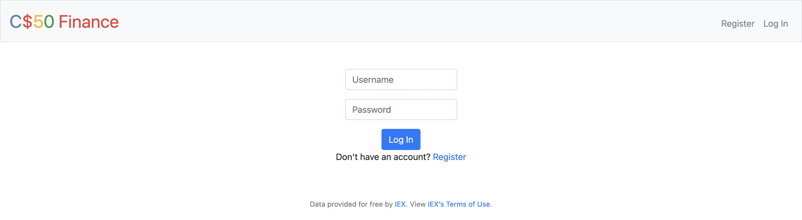
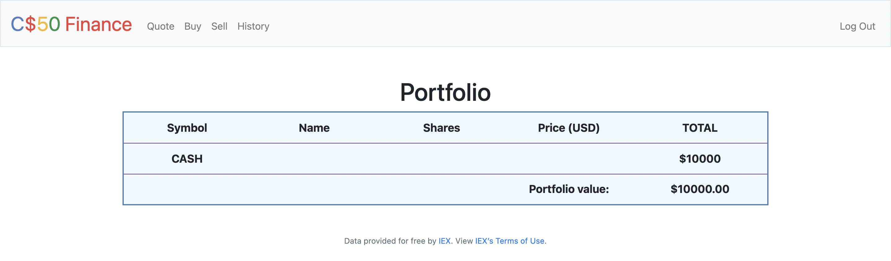
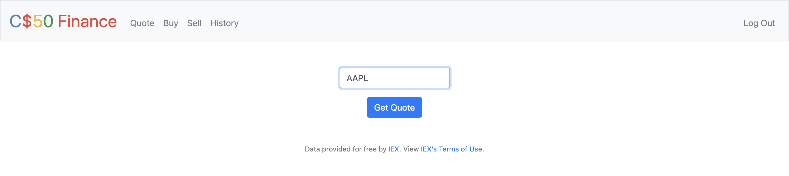
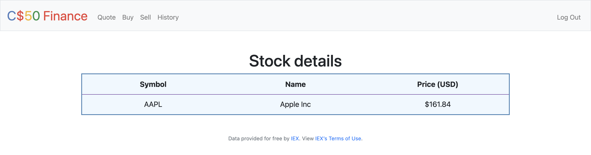
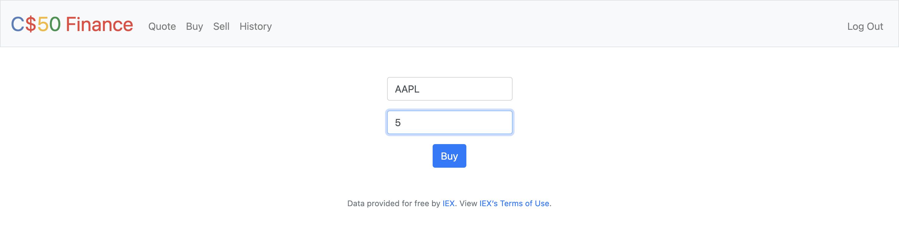
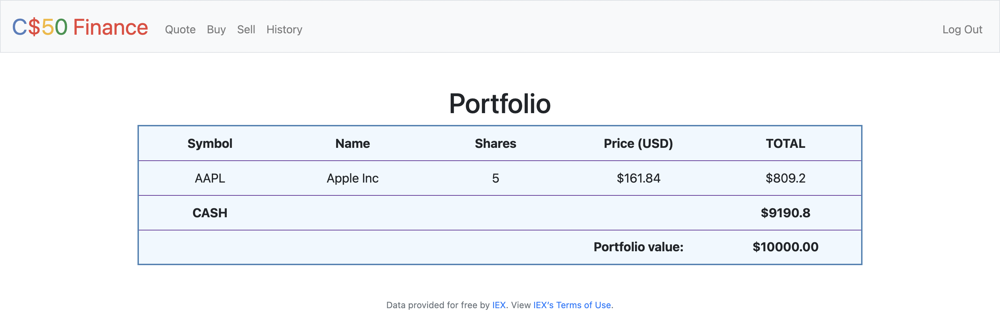
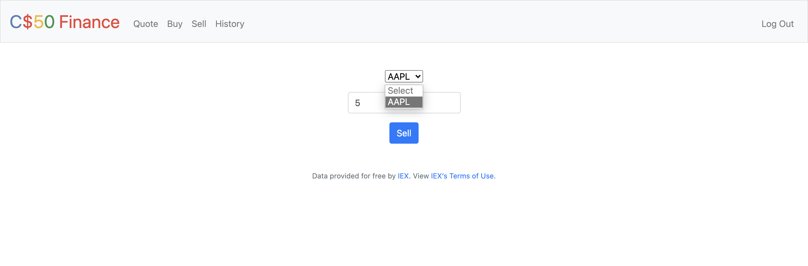
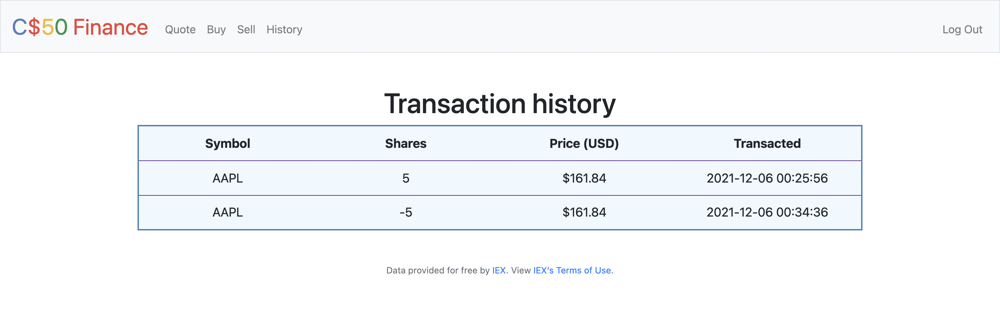

# Finance
A full stack flask web application which simulates the buying and selling of stocks.

This is project 9 of the course [CS50x 2021](https://cs50.harvard.edu/x/2021/)

Functionalities include:
- User authentication
- Index page displaying user's full portfolio
- Starting cash balance of $10,000
- Searching for a stock quote by symbol
- Buy & sell shares
- A history of past transactions
- Custom error messages

Real-time data provided for free by [IEX](https://exchange.iex.io/products/market-data-connectivity/). View [IEX's Terms of Use](https://iexcloud.io/terms/)

All stock prices are in $USD.

# Project goals
- Create first full stack web application
- Learning Flask
- Implementing MVC design pattern
- Sending GET and POST requests to routes & handling them
- Implementing user authentication & storing sessions 
- Learning and working with APIs (IEX cloud)

# Starting the application
When you fire up the application, you'll be greeted with a login form. Feel free to register for an account with any credentials (password restrictions are not enforced). Once you are logged in, you will see your current portfolio, which will initially contain a $10,000 cash balance for you to use.

The login page:

Initial portfolio page:

# Quote
You can search for a stock quote by clicking "Quote" in the navigation bar. Enter the ticker symbol of the company you wish to look up in the text field. If you enter a symbol that does not exist, an error page will be displayed. Similarly in buy and sell, entering a non-existent symbol redirects you to an error page.

For example, getting a quote on Apple (ticker symbol - AAPL):

And the result of the search:

# Buy
To buy shares, click on "Buy" in the navbar and enter the stock you wish to buy, and how many shares of it.

For example, I'd like to buy 5 shares of AAPL:

After you buy shares, you get redirected to your portfolio page, with your updated holdings.

# Sell
You can sell any amount of shares that you own for a stock. For example, the 5 shares of Apple that were purchased can be sold:

After selling, you will be redirected to your portfolio page, with your updated holdings.

# History
You can view your transaction history.

